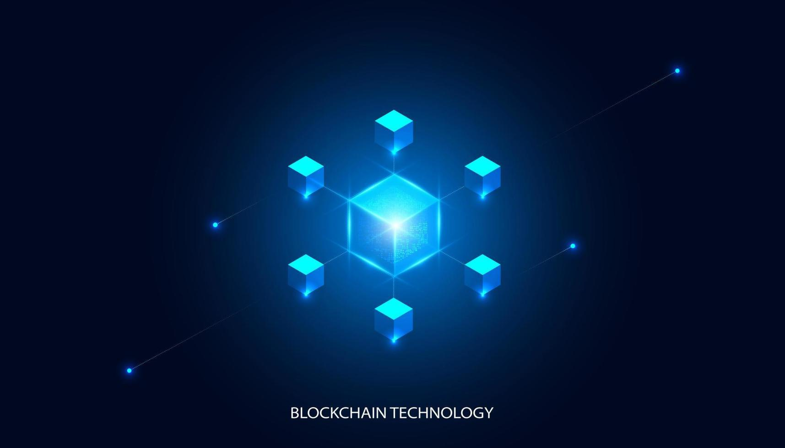

# Blockchain from scratch



## About The Project

Demonstration of building a blockchain from scratch and understanding how blocks interact underneath the hood. It also illustrates how to adjust the difficulty levels and mimic peer-to-peer connections using Radis.

# What is Blockchain?

Blockchain is a decentralized, digital ledger that records transactions across a network of computers. Each block in the chain contains a number of transactions, and every time a new transaction is added to the network, it is recorded in a block. Once a block is added to the chain, it cannot be altered, ensuring the integrity and immutability of the data.

The technology behind blockchain is based on cryptography, which is used to secure and verify the transactions on the network. Each block in the chain is connected to the previous block through a cryptographic hash, which serves as a unique fingerprint for that block. This creates a chain of blocks that are linked together, making it impossible to alter or tamper with the data in any previous block without breaking the entire chain.

Blockchain also uses a consensus mechanism, such as proof-of-work or proof-of-stake, to ensure that the network agrees on the state of the ledger. This helps prevent malicious actors from corrupting the network or altering the data.

In summary, blockchain is a digital ledger that is maintained across a network of computers, and uses cryptography and consensus mechanisms to ensure the integrity and immutability of the data.

# Getting Started

## Requirements

- [git](https://git-scm.com/book/en/v2/Getting-Started-Installing-Git)
  - You'll know you did it right if you can run `git --version` and you see a response like `git version x.x.x`
- [Nodejs](https://nodejs.org/en/)
  - You'll know you've installed nodejs right if you can run:
    - `node --version` and get an ouput like: `vx.x.x`
- [Yarn](https://classic.yarnpkg.com/lang/en/docs/install/) if you want instead of `npm`
  - You'll know you've installed yarn right if you can run:
    - `yarn --version` and get an output like: `x.x.x`
    - You might need to install it with npm

# Built With

- [Node.js](https://nodejs.org/en/)
- [Javascript](https://www.javascript.com/)

## Setup

Clone this repo

```
git clone https://github.com/vaasanthk/Blockchain-.git
cd Blockchain
```

Then install dependencies

```
yarn or npm i
```

## Usage

Run

```
npm run dev - for the client node

```

```
npm run dev-peer - for the peers node

```

## Install dependencies

```
npm i redis@2.8.0
npm i nodemon --save-dev
npm i body-parser --save
npm i hex-to-binary@1.0.1 --save
npm i crypto
npm i cross-env --save-dev
npm i express
```

# Thank you!
